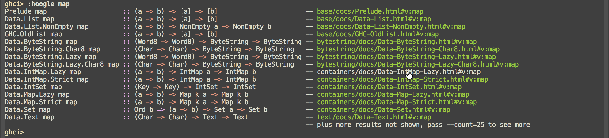
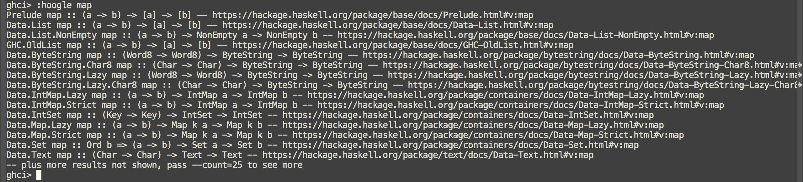
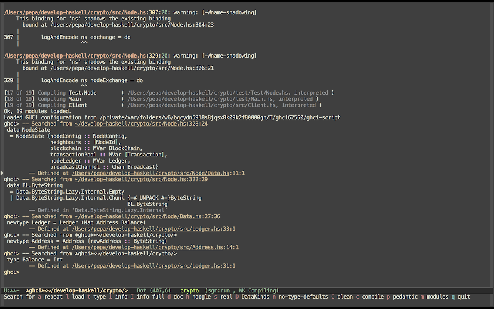

# simple-ghci-mode

### Prettified output of `:hoogle` command

### Standard output of `:hoogle` command

### Example

### Stack template

To get quickly up and running stack template is provided (based on https://github.com/commercialhaskell/stack-templates/blob/master/new-template.hsfiles).

	stack new my-project https://raw.githubusercontent.com/VlachJosef/simple-ghci-mode/master/simple-ghci.hsfiles
